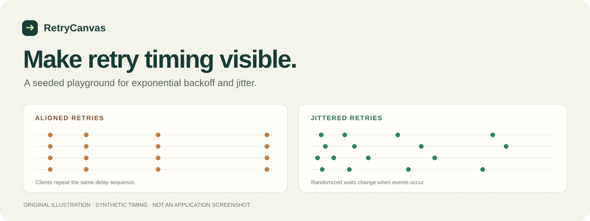
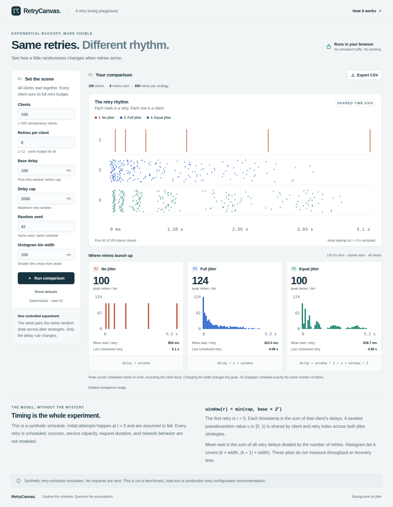
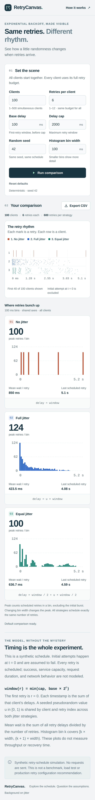

<p align="center">
  
</p>

# RetryCanvas

**See how retry timing changes when you add jitter.**

RetryCanvas is a browser-only playground for capped exponential backoff. Compare
no jitter, full jitter, and equal jitter with the same clients, retry budget,
and seeded random samples. Inspect the schedule, change one assumption, and
export the synthetic events as CSV.

Built for engineering explanations, design discussions, and small experiments.
All requests are simulated. The app never sends traffic to a target service.

[Live demo](https://tabisharaza.github.io/retrycanvas/) · [Quick start](#quick-start) ·
[The model](docs/MODEL.md) ·
[Contribute](CONTRIBUTING.md) · [Roadmap](docs/ROADMAP.md)

## What you can explore

- **Three delay strategies** with a shared scenario and reproducible seed
- **Timing and distribution** views that make synchronized retries visible
- **Explicit retry counts and bin widths** so the numbers have context
- **CSV export** for inspecting the individual synthetic events
- **A compact local app** with no account, API key, backend, or built-in telemetry

The hero above is an original illustration, not a screenshot or benchmark.

## Screenshots

Real browser captures of the default scenario from the
[passing browser test run](https://github.com/Tabisharaza/retrycanvas/actions/runs/37581903864).
The desktop and Pixel 7 emulation captures show the same synthetic inputs.



<details>
<summary>View the mobile screenshot</summary>



</details>

## Quick start

Use **Node.js 24** and npm. The repository includes `.nvmrc` and a lockfile.
From the repository root:

```sh
npm ci
npm run dev
```

Open the local URL printed by Vite. The app's base path is `/retrycanvas/`.

```sh
npm run check       # lint, typecheck, unit/DOM tests, production build
npm run preview     # serve the production build locally, after npm run build
```

Individual checks are available with `npm run lint`, `npm run typecheck`,
`npm test`, and `npm run build`. See [Contributing](CONTRIBUTING.md) for browser
tests and the development workflow. Installing dependencies needs network
access; running the synthetic model does not need an external service.

## A two-minute experiment

1. Start with the default: 100 clients, 6 retries each, 100 ms base, 2,000 ms
   cap, seed 42, and 100 ms histogram bins.
2. Compare no jitter with full jitter. Look at where retries land over time.
3. Compare equal jitter. Its waits retain at least half of each retry's window.
4. Change only the seed, click **Run comparison**, and compare again. A single
   random sample is not a guarantee about future traffic.
5. Export the CSV and inspect a client's cumulative timestamps. Exports use the
   displayed comparison, so apply input changes before exporting.

For every strategy, a scenario with `N` clients and `R` retries per client has
`N × R` retries and `N × (R + 1)` total attempts. Every attempt fails in this
model. Changing the strategy changes timing; it cannot reduce the fixed event
count or demonstrate improved throughput or recovery.

## The arithmetic is part of the interface

For retry index `r`, starting at `0` for the first retry:

```text
window = min(cap, base × 2^r)

no jitter    = window
full jitter  = u × window
equal jitter = window / 2 + u × window / 2
```

`u` is a seeded uniform sample in `[0, 1)`. Full and equal jitter use the same
sample for a corresponding client/retry pair. The cap applies to each wait,
not the overall timeline.

Charts and CSV contain retries only; the initial attempts are excluded. Peak
retries are counted in fixed-width bins and exclude the initial burst.
Always keep the bin width with the number. Read the
[model guide](docs/MODEL.md) for a worked example, metric definitions, and
limitations.

## What this model leaves out

No actual HTTP requests, service capacity, request durations, successful
responses, recovery conditions, adaptive rate limiting, or production traces
are modeled. There is no “best configuration” recommendation. Use your SDK's
current documentation and a service-specific validation process for real
systems.

The delay strategies are established techniques. The implementation and visual
design in this repository are independently written. Helpful background:

- [Exponential Backoff And Jitter, AWS Architecture Blog](https://aws.amazon.com/blogs/architecture/exponential-backoff-and-jitter/)
- [AWS SDK retry behavior reference](https://docs.aws.amazon.com/sdkref/latest/guide/feature-retry-behavior.html)

RetryCanvas uses a deliberately different, all-fail model from the AWS blog's
contention simulation and is not an exact clone of any SDK.

## Privacy and safety

The simulation runs in memory in your browser. There is no built-in account,
analytics, remote API integration, or scenario persistence. A CSV is created
only when you choose to download it. Hosting providers and development servers
can still observe ordinary page and asset requests; browser extensions and
local downloads are outside the app's control.

Use synthetic inputs and keep secrets out of seeds, screenshots, exported
files, and bug reports. See [Security](SECURITY.md).

## Find your way around

- [Architecture](docs/ARCHITECTURE.md): code boundaries and data flow
- [Model](docs/MODEL.md): formulas, invariants, and interpretation
- [Contributing](CONTRIBUTING.md): setup, tests, and review expectations
- [Roadmap](docs/ROADMAP.md): bounded contribution proposals
- [Product notes](docs/PRODUCT_NOTES.md): audience and possible future experiments
- [Third-party notices](THIRD_PARTY_NOTICES.md): dependency and asset provenance

Questions, corrections, accessibility improvements, and small well-tested PRs
are welcome. Start with a reproducible example or one of the contribution
proposals. This is an educational project; any workshop or private integration
idea is a hypothesis to validate, not an established business or revenue
promise.

## License

Original project code and documentation are available under the
[MIT license](LICENSE). Third-party dependencies retain their own licenses.
